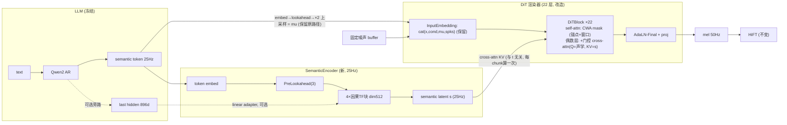

# CosyVoice3 FM 流式与少步生成改造方案

> 目标：对 CosyVoice3 的 flow-matching（FM）token2mel 模块做三项耦合升级 ——
> **(A) 支持流式合成的注意力机制**（有界窗口 + 锚点，KV cache 增量推理）、
> **(B) 通过 cross-attention 将 semantic latent 注入声学渲染器**（增强韵律/情感保留）、
> **(C) 单步/少步蒸馏**（NFE 20 → 1~2，降低推理开销与首包延迟）。
> LLM、speech tokenizer、HiFT 声码器全部保持冻结/不变，改造只发生在
> `cosyvoice/flow/` 内，并保持 `CausalMaskedDiffWithDiT.inference` 对外接口兼容。

**TL;DR**：现在的流式路径每个 chunk 对"prompt + 全部历史"重算 10 步 Euler ×
CFG 双分支（20 次 DiT 前向，序列随时间线性变长）。方案先把注意力改成
"锚点(prompt) + 滑动窗口"的 chunk 因果结构（训练/推理一致），使单 chunk 计算量
恒定并允许 KV cache；再在 DiT 内加入零初始化门控的 cross-attention，让 22 层
渲染器逐层重新读取 25 Hz 的 semantic latent（而不是只在输入端拼一次通道）；
最后分三小步蒸馏（CFG 内化 → 一致性蒸馏 2~4 步 → DMD2 单步），单步学生 +
KV cache 后每 chunk 只需 1 次有界长度的 DiT 前向，估算 flow 部分计算量降低
约 20×（无 cache）~ 100×（有 cache），首包延迟从 ~0.5–0.7 s 降到 ~0.25–0.35 s
（LLM 出 token 成为瓶颈）。三项改造相互成就：**少步化是 KV cache 在显存上可行
的前提，窗口化注意力是少步学生在长流式下计算恒定的前提**。

---

## 目录

1. [现状剖析（代码级）](#1-现状剖析代码级)
2. [总体架构](#2-总体架构)
3. [模块 A：流式注意力 CWA（Chunk-aligned Window + Anchor）](#3-模块-a流式注意力-cwachunk-aligned-window--anchor)
4. [模块 B：semantic latent 的 cross-attention 注入](#4-模块-bsemantic-latent-的-cross-attention-注入)
5. [模块 C：少步蒸馏](#5-模块-c少步蒸馏)
6. [训练流程与阶段划分](#6-训练流程与阶段划分)
7. [推理集成](#7-推理集成)
8. [延迟与算力预算](#8-延迟与算力预算)
9. [评测方案](#9-评测方案)
10. [风险与备选路径](#10-风险与备选路径)
11. [落地文件清单与里程碑](#11-落地文件清单与里程碑)
12. [参考](#12-参考)

---

## 1. 现状剖析（代码级）

以 CosyVoice3 路径为准（`CausalMaskedDiffWithDiT` + `CausalConditionalCFM` +
`DiT`，配置见 `examples/libritts/cosyvoice3/conf/cosyvoice3.yaml`）。

### 1.1 数据流

```
LLM (Qwen2, 冻结)                     flow (本方案改造对象)                HiFT (因果, 不变)
text ──► semantic token (FSQ 6561, 25Hz)
              │ cosyvoice/flow/flow.py:386-395
              ▼
        input_embedding (6561→80)
              ▼
        PreLookaheadLayer (右看 3 token ≈ 120ms)
              ▼
        repeat_interleave ×2  ──► mu (80 维, 50Hz)
              ▼
        CausalConditionalCFM: z=固定噪声buffer, 10 步 Euler(cosine), CFG 0.7
              ▼  每步调 estimator (DiT: dim1024/depth22/heads16, ~330M)
        mel (80 维, 50Hz) ──► CausalHiFTGenerator ──► 24kHz wav
```

### 1.2 三个瓶颈

**瓶颈 ①：semantic 信息注入过弱。**
`mu`（semantic token 的 80 维嵌入）只在 DiT 入口与噪声 `x`、prompt mel `cond`、
说话人 `spks` 做一次通道拼接（`cosyvoice/flow/DiT/dit.py:156`，
`InputEmbedding.proj(cat[x, cond, mu, spks])`，`modules.py:81`）。此后 22 层
transformer 再无任何通道能重新读取 semantic 流。韵律/情感这类需要跨多帧、跨层
维持的超音段信息，在深层容易被声学细节"冲刷"掉；且 token→mel 被
`repeat_interleave ×2` 硬锁成 2:1 对齐，模型无法在边界附近柔性取上下文。
另外 LLM 的最后层 hidden states（896 维，含丰富的韵律/语义信息，
`cosyvoice/llm/llm.py:237-240` 本来就 `output_hidden_states=True`）目前被完全
丢弃，只保留了离散 token id。

**瓶颈 ②：流式注意力 = 全左上下文 + 每 chunk 全量重算。**
- streaming 时 DiT 用 `add_optional_chunk_mask(..., static_chunk_size=50, -1)`
  （`dit.py:163-164`）产生 chunk 对齐因果 mask；但 ONNX 友好版
  `subsequent_chunk_mask` 已**不支持左 chunk 数限制**
  （`cosyvoice/utils/mask.py:154` 的 NOTE），左上下文恒为全部历史。
- 推理每个 chunk 都把 "prompt + 迄今全部 token" 整段送进
  `flow.inference`，再切掉 `token_offset` 之前的输出
  （`cosyvoice/cli/model.py:425-436`）。由于 chunk 因果 mask + 固定噪声 buffer
  （`flow_matching.py:200` `rand_noise`）保证前缀结果逐位复现（`flow.py:437-443`
  的 `__main__` 一致性测试验证的正是这一点），**这些重算是纯浪费**。
- 每 chunk 计算量 O(P+T)，整句 O(T²)；现在靠 hop 从 25 token 翻倍涨到 100
  （`model.py:410-413`）摊销，代价是**出包间隔越来越长**（1s→4s），交互体验
  随句长漂移。TRT engine 也被迫按 max 3000 帧建 profile（`model.py:95-99`）。

**瓶颈 ③：NFE = 20 / chunk。**
`n_timesteps=10` 写死在调用点（`flow.py:409`），CFG 用 batch=2 双分支
（`flow_matching.py:95-100`），即每个 chunk 20 次 ~330M 参数的 DiT 前向。
这是流式 RTF 和首包延迟的主要成分，也是 KV cache 不可行的根源：
10 步 × 2 分支意味着要存 20 份逐层 KV（估算 ~800MB/路会话，见 §8.3）。

### 1.3 三者的耦合关系

```
少步蒸馏(C) ──使 KV cache 显存可行──► 流式注意力(A) 的 L2 增量模式
流式注意力(A) ──保证蒸馏学生在长流式下训练/推理 mask 一致──► (C)
cross-attn(B) ──弥补少步化损失的条件信息带宽(韵律/情感)──► (C) 的质量下限
```

因此实施顺序必须是 **A/B（架构 + 继续训练）→ C（蒸馏）**，蒸馏永远在最终
架构上做。

---

## 2. 总体架构



要点：

- **mu 的输入拼接路径完整保留**，cross-attention 是加法增强且门控零初始化 →
  改造后 0 训练步时模型与官方 checkpoint 逐位等价，可安全热启动。
- semantic latent 保持 **25 Hz**（不上采样），KV 长度减半，且与 mel 率解耦。
- 蒸馏后的学生与教师**共享同一 estimator 签名**，TRT/Triton 导出路径不变。

---

## 3. 模块 A：流式注意力 CWA（Chunk-aligned Window + Anchor）

### 3.1 Mask 定义（训练/推理一致）

保持现有 chunk 网格：mel chunk = 50 帧（= 25 token × 2 = 1 s），与
`static_chunk_size`、`token_hop_len=25`（`model.py:410`）、以及 prompt 对齐
padding（`model.py:345` `prompt_token_pad`）完全兼容。

对第 `qc` 个 chunk 里的 query 帧，可见的 key chunk 集合：

```
visible(qc) = { kc : kc ≤ qc }                          # chunk 对齐因果（现状）
            ∩ ( { kc ≥ qc − W }                          # 滑动窗口, W 个左 chunk
              ∪ { kc < A } )                             # 锚点: prompt 所在前 A 个 chunk
```

- **W（窗口）**：默认 4（= 4 s 声学左上下文）。决定稳态计算量与 KV cache 大小。
- **A（锚点）**：prompt 占据的 chunk 数。prompt 已被 pad 到 chunk 网格
  （`model.py:345`），推理时 `A = ceil(prompt_feat_len / 50)`。锚点永远可见，
  作用等同 attention-sink + 说话人/风格记忆：保证长句中后段音色不漂移，
  也吸收 softmax 的"下水道"注意力（StreamingLLM 的经验）。
- 训练时 `A` 直接取该样本 `conds` 前缀覆盖的 chunk 数（训练本来就用随机
  0–30% GT mel 前缀模拟 prompt，`flow.py:351-357`），`W` 从
  `{2, 3, 4, ∞(p=0.25)}` 采样，保留一定比例全上下文样本以保底离线质量。

实现为纯算术、ONNX/TRT 友好（替换 `subsequent_chunk_mask` 的调用点，不改它本身）：

```python
# cosyvoice/flow/DiT/streaming_mask.py (新)
def chunk_window_anchor_mask(size, chunk_size, num_left_chunks, num_anchor_chunks, device):
    idx = torch.arange(size, device=device)
    c = torch.div(idx, chunk_size, rounding_mode='trunc')
    qc, kc = c.unsqueeze(1), c.unsqueeze(0)
    causal = kc <= qc
    window = kc >= qc - num_left_chunks
    anchor = kc < num_anchor_chunks
    return causal & (window | anchor)        # (L, L) bool
```

`num_left_chunks < 0` 时退化为现有全左上下文 mask（向后兼容开关）。
非 streaming（离线）分支维持现状的全双向 mask 不动。

### 3.2 位置编码（RoPE）策略

- 训练与推理都用**真实绝对帧位置**，不做 per-row 重定位（稠密训练无法逐行
  重排位置）。窗口内相对距离 ≤ (W+1)×50 帧，天然有界。
- 锚点↔query 的相对距离随句长增长。训练语料 ≤ ~30 s（≤1500 帧）覆盖了绝大多
  数场景；对超长会话（>30 s 不间断流式）：
  - **L1 重算模式**（§3.4）下每 chunk 免费重建锚点 K/V，可将锚点 key 的位置
    钳制到 `max(true_pos, q_pos − D_max)`（`D_max` 取训练最大长度的 80%），
    等价于"把 prompt 平移到窗口前固定距离处"；
  - **L2 cache 模式**下锚点 K 已按写入时位置旋转，改为每 N 个 chunk（如 32）
    重算一次锚点 K/V（锚点很短，代价可忽略）。
  这两个近似只影响锚点分支，需在长音频评测（§9）中过门槛。
- 现在 `self.rotary_embed.forward_from_seq_len(seq_len)`（`dit.py:158`）从 0
  开始编位置；需要改为支持 `offset` / 显式位置张量（小改动）。

### 3.3 卷积状态

DiT 内部只有 `CausalConvPositionEmbedding`（2 层因果卷积，kernel 31，
`modules.py:115`）带跨帧感受野：增量推理时缓存每层最后 30 帧输入即可逐位
等价（≈120 KB/会话）。`PreLookaheadLayer` 与 SemanticEncoder 的因果卷积同理。

### 3.4 两级推理实现

**L1 —— 有界窗口重算（先落地，TRT 友好）**：
每 chunk 只把 `锚点 ∪ 窗口 ∪ 当前 chunk` 这一段（≤ (A+W+1)×50 ≈ 300–500 帧）
送入 estimator，丢弃窗口外历史。因为 mask 保证窗口外帧对当前 chunk 无影响
（训练一致），结果与全量重算逐位相同。改动集中在
`CausalMaskedDiffWithDiT.inference` 里做切片和输出偏移，`solve_euler` 不动。
收益：单 chunk 计算量**恒定**（不再随句长线性涨），hop 不必再翻倍增长
（`token_max_hop_len` 机制可删除，稳定 1 s 出包节奏）；TRT profile 从
max 3000 帧收缩到 ~512 帧的近静态 shape。

**L2 —— 逐层 KV cache 增量推理（蒸馏完成后启用）**：
每 chunk 只算 50 个新帧的 Q/K/V，attend 到 cache 中的锚点+窗口 K/V，然后把
本 chunk K/V 追加进 ring buffer。cache 键为 `(layer, ode_step, cfg_branch)`：
固定 t 网格（`t_span` 每 chunk 相同，现状即如此）+ chunk 因果 mask + 固定噪声
buffer，三者共同保证老帧在第 k 步的激活与当初完全一致，cache 命中即逐位复现。
**显存核算（§8.3）表明该模式只有在 NFE≤2 且 CFG 单分支后才实用**，
因此 L2 与模块 C 绑定交付。

```python
# 会话级 cache 结构（cosyvoice/flow/DiT/cache.py, 新）
@dataclass
class FlowStreamCache:
    self_kv: Dict[int, List[Tensor]]   # ode_step -> [depth] (2, B, H, T_ctx, 64) ring buffer
    cross_kv: List[Tensor]             # [n_cross] (2, B, H, T_tok, 64)，与 t 无关，每 chunk 更新一次
    conv_state: List[Tensor]           # 各因果卷积尾部状态
    sem_cache: SemanticEncoderCache    # 25Hz 侧的等价结构
    offset_mel: int
```

### 3.5 正确性验收

扩展 `flow.py` 的 `__main__` 一致性测试为正式 CPU 单测
（`fm_streaming/tests/test_stream_consistency.py`）：随机权重小模型上验证
① L1 切片输出 == 全量 streaming 输出（逐位）；
② L2 cache 输出 == L1（fp32 下 max|Δ| < 1e-5）；
③ 锚点位置钳制开启后误差有界且只作用于 >D_max 的会话。

---

## 4. 模块 B：semantic latent 的 cross-attention 注入

### 4.1 semantic latent 来源

| 选项 | 内容 | 取舍 |
|---|---|---|
| **A（默认）** | token embedding → SemanticEncoder | 自包含；vllm/TRT 部署无额外耦合 |
| B（可选开关） | A + LLM last hidden（896d）经 linear adapter 相加 | 韵律/情感线索最丰富；但 vllm 路径拿不到 hidden（`llm.py:505+` 只回 token id），只能 torch LLM 路径用，需按 flag 降级 |
| C | 仅 LLM hidden | 部署耦合过深，放弃 |

默认交付 A，B 做成 `use_llm_hidden: bool` 的可选实验（缺 hidden 时 adapter
输入置零，训练时以 p=0.5 随机置零使模型两态都可用）。

### 4.2 SemanticEncoder（25 Hz）

- 结构：`Embedding(6561, 512)`（独立于 flow 现有 80 维嵌入）→ 复用
  `PreLookaheadLayer(512, pre_lookahead_len=3)` 的右看机制（与现有 3-token
  lookahead 同预算，不增加首包等待）→ 4 层因果 transformer
  （dim 512 / heads 8 / ff×4，chunk 因果 mask，chunk=25 token，同样的
  W/A 窗口锚点规则）→ LayerNorm 输出 `s ∈ (B, T_tok, 512)`。
- 参数量 ≈ 16 M。流式下每 chunk 只前向 25 个新 token（带自己的 KV/conv cache）。
- prompt 的 token 也在序列里（`flow.py:386` 本来就 concat prompt_token），
  所以 prompt 段的 semantic latent 自动成为跨句风格记忆的一部分。

### 4.3 DiT 块改造：门控 cross-attention

在 22 层中**每隔一层**（11 处，可配 `cross_attn_every_n=2`）的
self-attn 与 FFN 之间插入：

```python
# DiTBlock.forward 内（modules.py:516 起的现有流程之后）
x = x + gate_msa * self_attn(...)                     # 现状
x = x + tanh(g_ca) * cross_attn(LN(x), kv=s_proj)     # 新增；g_ca 零初始化
x = x + gate_mlp * ff(...)                            # 现状
```

- **Flamingo 式零初始化 tanh 门控**（`g_ca` 为逐通道可学参数，init=0）：
  第 0 步不改变任何输出 → 直接加载官方 `flow.pt` 热启动；训练中门控自行长开。
- **KV 侧不做 t 调制**（只过普通 LayerNorm + 线性投影）：cross-attn 的 K/V
  与扩散时间步无关 → 每 chunk 计算一次、10 步（或 1 步）共享，也能进 cache；
  t 只调制 Q 侧（沿用 AdaLN 风格但独立小线性层）。
- 维度：Q 1024→1024，K/V 512→1024，out 1024→1024；每处 ≈ 3.2 M 参数，
  11 处合计 ≈ 35 M（估计整个 estimator +11%）。
- **跨率 RoPE**：query 位置取 `i_mel × 0.5`（换算到 token 轴），key 位置取
  `j_tok`，使相对距离在 token 尺度上可比；单独一套 `RotaryEmbedding`。

### 4.4 流式对齐 mask（token 率）

mel 帧 `i` 属于 chunk `qc = i // 50`；可见 token chunk 集合与 §3.1 完全同一套
`visible(qc)` 规则（token chunk = 25 token）。当前 chunk 内 25 个 token 全可见
—— 右侧 3-token lookahead 信息已经由 SemanticEncoder 的 PreLookahead 卷积
折叠进当前 chunk 的 latent（调度器本来就等够 `hop + pre_lookahead_len` 个
token 才启动 flow，`model.py:349`），不需要额外跨 chunk 泄露。

可选消融：在 visible 集合内再叠一条**带状 mask**
`j ∈ [i/2 − 16, i/2 + 3]`，强化局部单调对齐、防注意力漂移；默认关。

### 4.5 CFG 一致性

训练 `training_cfg_rate=0.2` 的条件 drop（`flow_matching.py:185-189`）扩展为
同一枚 `cfg_mask` 同时置零 `mu`、`spks`、`cond` **和 semantic latent `s`**
（整体作为"条件"被引导）；推理 CFG 公式不变。蒸馏内化 CFG 后此处自然消失。

### 4.6 为什么这能改善韵律/情感

- 逐层重读：22 层里 11 个"再对焦"点，超音段特征（F0 轮廓、能量包络、语速
  节奏对应的 token 统计结构）不再只靠输入端一次注入硬撑到底。
- 25 Hz + 跨率 RoPE：注意力可在边界处柔性看邻近 token（协同发音、语调延伸），
  突破 repeat_interleave 的刚性 2:1。
- prompt token 作为 K/V 常驻（锚点规则），风格/情感从 prompt 到续写段的迁移
  通道比"仅 mel cond 拼接"更直接。
- 与 B 选项（LLM hidden）叠加时，情感指令类信息（CosyVoice3 instruct 用法）
  可以绕过离散化瓶颈直达渲染器。

---

## 5. 模块 C：少步蒸馏

三小步走，每步独立可验收、可回退；全部在 **A+B 完成继续训练之后**的模型上做。
训练目标沿用现有 CFM 记号（`flow_matching.py:176-192`）：
`x_t = (1−(1−σ)t)·z + t·x1`，t: 0=噪声 → 1=数据，教师速度场 `v_T`。

### 5.1 S3 —— CFG 内化（20 NFE → 10 NFE，零风险）

学生 = 教师副本，回归带引导的教师速度场（w = `inference_cfg_rate` = 0.7）：

```
L_cfg = E_{x1, z, t} ‖ v_s(x_t, t, c) − [(1+w)·v_T(x_t, t, c) − w·v_T(x_t, t, ∅)] ‖²
```

- t 采样偏向生产网格（cosine `t_span`，`flow_matching.py:224-226`）：
  50% 均匀 + 50% 网格点。
- 可选：给学生加 w 条件嵌入（加到 t-embedding 上，蒸馏时 w∼U[0,1]），保留
  运行时引导强度旋钮；默认固定 w=0.7 求简。
- 产物：单分支 10 步模型。质量应与教师无差（纯函数回归）；同时 KV cache
  显存需求即刻减半。

### 5.2 S4a —— 一致性蒸馏（10 NFE → 2~4 NFE，"产品可用档"）

自洽函数参数化（边界条件在 t=1 自动满足，且**复用 estimator 原签名**，
输出仍解释为速度）：

```
f_θ(x, t, c) = x + (1−t) · v_θ(x, t, c)        # 到终点的一步 Euler 外推
```

离散 CD：在生产 cosine 网格 `{t_k}` 上取相邻对，`x_{t_k}` 由前向过程从数据
采样，教师（S3 产物，单分支）做一步 Euler 得 `x̂_{t_{k+1}}`，优化

```
L_cd = d( f_θ(x_{t_k}, t_k, c),  stopgrad f_{θ⁻}(x̂_{t_{k+1}}, t_{k+1}, c) )
```

`θ⁻` 为 EMA；`d` 用 Huber（对 mel 尺度更稳）。采样时 2~4 步 ping-pong
（f → 重加噪到中间 t → f）。若离散 CD 不稳，升级到 sCM/ECT 连续时间形式。
产物：2 步档（质量回退保险 + 中端 GPU 档位）。

### 5.3 S4b —— DMD2 单步（旗舰档）

- **生成器**：`G_θ(z, c) = z + v_θ(z, t=0, c)`，从 S4a 学生初始化，
  架构/签名完全不变（TRT 导出零改动）。
- **分布匹配**：velocity 空间的 DMD 梯度 —— 冻结教师 `v_T`（真分布 score 的
  代理）+ 在线训练的假评论家 `v_ψ`（对 `G_θ` 输出重加噪后拟合 CFM 损失），

```
∇_θ L_dmd ≈ E_{z, t'} [ ( v_ψ(x'_{t'}, t', c) − v_T(x'_{t'}, t', c) ) · ∂x'_{t'}/∂θ ],
x'_{t'} = (1−(1−σ)t')·z' + t'·G_θ(z, c)
```

  按 DMD2 实践：TTUR（ψ 每步多更 5 次）、不要教师回归项、两阶段（先纯 DMD
  再加 GAN）。
- **轻量对抗头**：mel 域 2D PatchGAN（改造
  `cosyvoice/hifigan/discriminator.py:149` 的 SpecDiscriminator 直接吃 mel），
  hinge loss，权重 0.05，仅最后 30% 步启用 —— 补单步模型的高频细节/清晰度。
- 产物：1 步单分支模型。**1 步 + 单分支才使 L2 KV cache 显存降到 ~40 MB/会话**
  （§8.3），两者绑定发布。

### 5.4 流式一致蒸馏的硬约束（易错点）

1. **mask 分布一致**：蒸馏 batch 按现有惯例 50% streaming（`flow.py:335`），
   且 streaming 样本的 (W, A) 采样分布与 S1/S2 完全相同；教师与学生在同一
   mask 下前向。
2. **条件构造一致**：`conds` 随机前缀、prompt token 拼接方式照抄训练现状，
   使学生見过"prompt 续写"分布。
3. **固定 t 网格 & 固定噪声 buffer**：学生推理仍走
   `CausalConditionalCFM.forward`（只是 `n_timesteps` 变 1/2），沿用
   `rand_noise` 以保 chunk 间确定性 —— 蒸馏时初始噪声照常采随机 z（分布一致
   即可），确定性 buffer 只是推理复现手段。
4. **少步 + chunk 因果 = 边界仍然逐位一致**：单步学生下，老 chunk 输出不受
   新 chunk 影响的性质纯由 attention mask 保证，一致性测试（§3.5）直接复用。

---

## 6. 训练流程与阶段划分

数据沿用本仓库现成管线（`examples/libritts/cosyvoice3` 与
`flow_grpo/prepare_wenetspeech4tts.py` / `prepare_aishell3.py`），只训 flow，
LLM/HiFT 冻结。

| 阶段 | 内容 | 训练量级(参考) | Go/No-Go 门槛 |
|---|---|---|---|
| S0 | mask/cache/一致性 CPU 单测，无训练 | – | 三项一致性测试全绿 |
| S1 | 架构手术 + 热启动：先只训新参数（SemanticEncoder + cross-attn + 门控）~20k 步，lr 1e-4 | 8×GPU 数天 | loss 不劣于教师基线；门控均值显著>0 |
| S2 | 全参继续训练（含 CWA 窗口/锚点 mask 采样），lr 1e-5 | ~100k 步 | CER/SS/DNSMOS ≥ 基线；W=4 有界窗口下无可听边界伪影 |
| S3 | CFG 内化蒸馏 | ~30k 步 | 与 S2+CFG 教师客观指标打平（±噪声） |
| S4a | 一致性蒸馏 2~4 步 | ~60k 步 | 2 步：DNSMOS 降幅 ≤0.05，CER +≤0.1pt，SS 降幅 ≤0.005 |
| S4b | DMD2 + GAN 单步 | ~40k 步 + 判别器 | 1 步 ≥ 2 步 CD 档的 90% 主观分；无金属感/嗡声 |
| S5 | 推理集成：L1→L2 cache、cli/model.py、TRT/Triton | – | §8 延迟目标；长音频 5 min 漂移测试通过 |

S1/S2 损失即现有 `compute_loss`（CFM MSE）不变；所有阶段保留 25% 非流式全
上下文样本以保底离线模式质量（离线/流式双模能力与现状一致）。

---

## 7. 推理集成

改动集中且保持接口兼容：

- `cosyvoice/flow/flow_matching.py`：`n_timesteps`、`inference_cfg_rate`
  改为可配（蒸馏后 `n_timesteps=1, cfg_rate=0`）；`solve_euler` 增加可选
  `cache` 透传。
- `cosyvoice/flow/flow.py`（`CausalMaskedDiffWithDiT.inference`）：
  L1 模式下按 `锚点∪窗口∪当前chunk` 切片输入、按偏移拼回输出；新增可选
  `stream_cache` 参数（None 时行为与现状完全一致）。
- `cosyvoice/cli/model.py`（`CosyVoice3Model`）：`token2wav` 不再传全量
  token，改传增量 + 会话 cache；删除 hop 翻倍逻辑（固定 25 token 节奏）；
  cache 生命周期挂在现有 `this_uuid` 会话字典上。
- TRT：单步单分支后 estimator 变成"一次前向、固定小 shape"，
  `get_trt_kwargs` 的 profile 收缩（max ≈ (A_max+W+1)×50 帧）；L2 cache 路径
  先走 torch（+`torch.compile`），TRT-cache 版留作后续优化。
- Triton（`runtime/triton_trtllm/model_repo/token2wav_dit`）同步镜像上述改动
  （独立 PR）。

---

## 8. 延迟与算力预算（估算，A10/L20 级 fp16，供定方向）

### 8.1 单次 estimator 前向

~330M 参数，序列 L 帧 ≈ `2·330M·L` FLOPs + 注意力项 ≈ L=500 时 ~0.35 TFLOPs。

### 8.2 每 chunk 计算量（prompt≈5s=250 帧，句长 20s 处稳态）

| 方案 | 前向次数 | 单次序列长 | 每 chunk FLOPs | 相对 |
|---|---|---|---|---|
| 现状（10 步×CFG，全前缀） | 20 | 250+1000+ (随句长涨) | ~10+ TFLOPs 且线性涨 | 1× |
| A 落地后 L1（10 步×CFG，有界窗） | 20 | ≤500 恒定 | ~7 TFLOPs 恒定 | ~0.7×但**不再增长** |
| + S3 (CFG 内化) | 10 | ≤500 | ~3.5 TFLOPs | ~0.35× |
| + S4a (2 步) | 2 | ≤500 | ~0.7 TFLOPs | ~0.07× |
| + S4b (1 步) L1 | 1 | ≤500 | ~0.35 TFLOPs | **~0.03×** |
| + S4b (1 步) L2 cache | 1 | Q=50, KV≤500 | ~0.04 TFLOPs | **~0.004×** |

### 8.3 KV cache 显存（为什么 cache 必须等蒸馏）

每帧每层 K+V = 2×1024×2 B = 4 KB；22 层 ×450 帧上下文 ≈ **40 MB / (步×分支)**。

| 配置 | 份数 | 会话显存 |
|---|---|---|
| 10 步 × CFG 双分支（现状直接加 cache） | 20 | ~800 MB ✗ |
| 10 步单分支（S3 后） | 10 | ~400 MB ✗ |
| 2 步（S4a 后） | 2 | ~80 MB △ |
| 1 步（S4b 后） | 1 | **~40 MB ✓**（+cross-attn KV ~10 MB + conv ~0.1 MB） |

### 8.4 首包延迟（stream=True 首 chunk：等 25+3 token）

| 成分 | 现状 | 方案后 |
|---|---|---|
| LLM 28 token（vllm） | ~150–300 ms | 不变 |
| flow 首 chunk | 20 次前向 ≈ 250–400 ms | 1 次前向 ≈ 15–30 ms |
| HiFT 50 帧 | ~10 ms | 不变 |
| **合计** | **~0.5–0.7 s** | **~0.25–0.35 s（LLM 主导）** |

稳态出包节奏由"hop 25→100 递增"变为恒定 1 s，长句尾部交互延迟不再漂移；
若要更细粒度，蒸馏后有预算把 chunk 降到 13 token（0.5 s）再训一档（备选项）。

---

## 9. 评测方案

**客观（复用本仓库 `flow_grpo/` 现成设施）**：`flow_grpo/evaluate.py` +
`rewards/`（Paraformer CER / ERes2Net SS / DNSMOS P.835），测试集
seed-tts-eval-zh（`fetch_cv3_eval.py`）+ AISHELL-3 自留集（已有 baseline 产物
可直接对比）。每阶段跑同一矩阵。

**流式专项**：
- 一致性：chunk-by-chunk vs 全量 streaming 输出 max|Δ|（fp32 <1e-5）；
- 边界伪影：chunk 接缝处 mel 谱通量 / MCD 与随机位置对照，Δ<5%；
- 长音频：5 min 不间断流式，SS 随时间曲线（锚点有效性）、每 chunk 延迟曲线
  （应为水平线）、显存曲线（应为水平线）；
- 首包/稳态 RTF 在 A10 与 L20 各测一轮。

**主观**：20 人 ×30 句 CMOS（含强情感/长句/中英混），比较
教师 vs S2 vs 2 步 vs 1 步；情感保真单独打分（B 模块的核心收益点）。

**消融矩阵**：cross-attn 开关 / 注入密度(22/11/8) / W∈{2,4,8} / 锚点开关 /
带状 mask / NFE∈{1,2,4,10} / semantic 来源(A vs A+B)。

---

## 10. 风险与备选路径

| 风险 | 症状 | 缓解/备选 |
|---|---|---|
| 有界窗口伤长程韵律 | 长句语调平淡、边界顿挫 | 调大 W；锚点扩展为"prompt+首句"；保底：W=∞ 回退（mask 开关兼容现状） |
| cross-attn 注意力漂移 | 偶发重复/含混 | 开带状 mask（§4.4）；降注入密度；门控 warmup 调度 |
| 1 步质量天花板 | 高频毛刺、情感变平 | 发布 2 步 CD 档兜底；GAN 权重网格搜索；升级 sCM |
| DMD2 训练不稳 | 评论家崩、mode collapse | 先交付 S4a（2 步）；DMD 换 regression-DMD1 起步 |
| 锚点位置外推（>30s） | 超长会话音色漂移 | §3.2 位置钳制/周期重算，长音频测试过门槛 |
| LLM hidden 旁路部署耦合 | vllm 拿不到 hidden | B 选项仅作实验开关，默认 A 方案不依赖 |
| TRT cache 工程量 | L2 上 TRT 复杂 | L2 先 torch.compile；TRT 只服务 L1 单步（已拿到大头收益） |

与 `flow_grpo/` 的协同：蒸馏后学生 rollout 成本降 ~20×，FlowTTS-GRPO 可在
1~2 步学生上继续做 RL 精调（奖励模型全套现成），作为本方案之后的增益项。

---

## 11. 落地文件清单与里程碑

```
新增
  cosyvoice/flow/DiT/streaming_mask.py      # CWA mask（自/交叉两个变体）
  cosyvoice/flow/DiT/semantic_encoder.py    # 25Hz SemanticEncoder + cache
  cosyvoice/flow/DiT/cache.py               # FlowStreamCache
  fm_streaming/distill/cfg_distill.py       # S3
  fm_streaming/distill/cd_distill.py        # S4a
  fm_streaming/distill/dmd2_distill.py      # S4b（生成器/评论家/判别器三优化器）
  fm_streaming/tests/                       # 一致性/门控零init/mask CPU 单测
  examples/libritts/cosyvoice3/conf/cosyvoice3_stream.yaml   # 新超参入口
修改
  cosyvoice/flow/DiT/modules.py             # GatedCrossAttention、RoPE offset
  cosyvoice/flow/DiT/dit.py                 # 注入点、CWA mask、cache 路径
  cosyvoice/flow/flow_matching.py           # n_timesteps/cfg 可配、cache 透传
  cosyvoice/flow/flow.py                    # L1 切片、stream_cache 参数
  cosyvoice/cli/model.py                    # CosyVoice3Model 增量调度、去 hop 翻倍
```

里程碑（人力按 1–2 人估）：
M1（~2 周）S0+架构代码+单测全绿 → M2（~4 周）S1/S2 训练达标 →
M3（~2 周）S3+S4a，交付 2 步档 → M4（~3 周）S4b 单步 + L2 cache →
M5（~2 周）S5 工程化 + 评测报告。

---

## 12. 参考

- Matcha-TTS / VoiceBox（CFM 训练与 CFG 形式，即本仓库现状来源）
- F5-TTS / SD3-MMDiT（DiT 声学骨干与本仓库 `flow/DiT` 同源）
- StreamingLLM: attention sink + 滑动窗口（锚点设计依据）
- Flamingo: 零初始化 tanh 门控 cross-attention 注入预训练模型
- Consistency Models / LCM / sCM(ECT)（S4a）
- DMD / DMD2（S4b 分布匹配蒸馏）；MeanFlow（单步 FM 的备选参数化）
- CoMoSpeech、FlashSpeech、DMOSpeech（语音扩散/FM 少步化先例）
- FlowTTS-GRPO（本仓库 `flow_grpo/`，蒸馏后可续接的 RL 精调）
