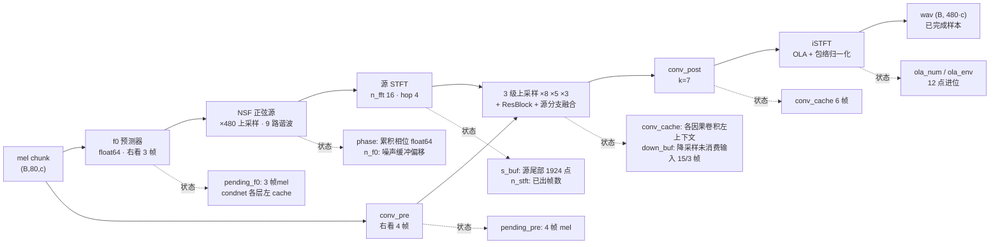
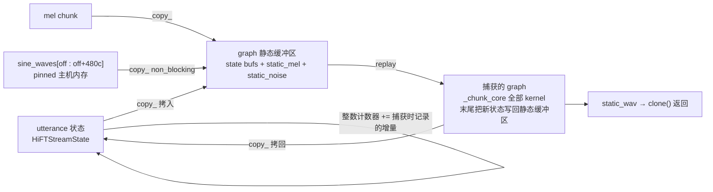

# CausalHiFT 增量流式声码器：原理详解

本文解释 `cosyvoice/hifigan/streaming.py` 的实现原理，配合代码阅读。性能与评测数字见
[`RESULTS.md`](RESULTS.md)。

模型常量（CosyVoice3-0.5B，24 kHz），下文反复用到：

| 量 | 值 | 含义 |
| --- | --- | --- |
| `n_fft` / `hop_len` | 16 / 4 | 声码器末端 iSTFT 的窗长与帧移（样本） |
| `upsample_rates` | [8, 5, 3]，乘积 `up = 120` | 主干三级上采样 |
| 每 mel 帧对应样本 | `up * hop = 480` | 24 kHz 下即 20 ms |
| f0 预测器首层 | kernel 4，`causal_padding = 3` | 右看 3 帧 |
| `conv_pre` | kernel 5，`causal_padding = 4` | 右看 4 帧 |
| 总 lookahead | 3 + 4 = 7 帧 = 140 ms | 决定流式的算法延迟 |
| `sine_waves` | (1, 7 200 000, 9) | NSF 的固定噪声缓冲，约 300 s |

---

## 1. 问题：为什么旧路径是 O(N²)

`CausalHiFTGenerator` 结构上完全因果（所有卷积都是 `CausalConv1d` 系列，只有 `conv_pre` 和 f0
预测器首层带右侧 lookahead），所以"分块跑"和"整句跑"结果一致。但
`CosyVoice3Model.token2wav` 的流式实现是把到目前为止的**全部** mel 拼起来重跑一遍，再按
`speech_offset` 切出新增部分：

```
chunk 1  ████                              ← 算 1 段，用 1 段
chunk 2  ┈┈┈┈████                          ← 算 2 段，丢 1 段
chunk 3  ┈┈┈┈┈┈┈┈████                      ← 算 3 段，丢 2 段
chunk 4  ┈┈┈┈┈┈┈┈┈┈┈┈████                  ← 算 4 段，丢 3 段
chunk N  ┈┈┈┈┈┈┈┈┈┈┈┈┈┈┈┈┈┈┈┈┈┈┈┈████
         ┈ = 重复计算后丢弃的前缀      █ = 真正新增的输出
```

两项成本：

1. **计算量 O(N²)**：总计算量随 chunk 数平方增长，单 chunk 延迟随位置线性增长。
2. **cuDNN plan 反复重建**：每次调用的 mel 长度都不同，cuDNN 要为每个新形状建执行计划，一次
   35–50 ms。这在生产里是常态，因为每条语句、每个 chunk 位置的长度都不一样。

增量推理同时消灭这两项：每个 chunk 只算自己的帧，形状固定，plan 全部命中。

---

## 2. 总体数据流与需要携带的状态



`HiFTStreamState` 一条 utterance 一份，稳态下共约 86 个张量（80 个卷积 cache + 2 个降采样缓冲
+ `pending_f0` / `pending_pre` / `phase` / `s_buf` / `ola_num` / `ola_env`）和 6 个整数计数器
（`n_f0` / `n_x` / `s_buf_start` / `s_total` / `n_stft` / `n_emitted`）。

### 各级的速率关系

一个 chunk 送入 `c` 帧 mel，稳态下各级产出：

| 级 | 单位 | 每 mel 帧的量 | 一个 chunk |
| --- | --- | --- | --- |
| f0 | 帧 | 1 | `c` |
| NSF 源 | 样本 | 480 | `480c` |
| 源 STFT | 帧 | 120 | `120c` |
| `conv_pre` 输出 | 帧 | 1 | `c` |
| 上采样第 1 级后 | 帧 | 8 | `8c` |
| 上采样第 2 级后 | 帧 | 40 | `40c` |
| 上采样第 3 级后 | 帧 | 120 | `120c` |
| iSTFT 输出 | 样本 | 480 | `480c` |

源分支的三个 `source_downs` 正是把 120 帧/mel 帧的 STFT 降到与主干各级对齐：

| 级 | 类型 | kernel / stride | 120 → | 与主干对齐 |
| --- | --- | --- | --- | --- |
| 0 | `CausalConv1dDownSample` | 30 / 15 | 8 | ups[0] 后的 8 |
| 1 | `CausalConv1dDownSample` | 6 / 3 | 40 | ups[1] 后的 40 |
| 2 | `CausalConv1d` | 1 / 1 | 120 | ups[2] 后的 120 |

---

## 3. 三类状态的原理

### 3.1 左因果卷积：cache 就是输入的尾巴

`CausalConv1d.forward(x, cache)` 本来就支持传入左上下文。流式实现要做的只是把"本次输入的最后
`causal_padding` 个样本"存下来，下次拼在前面（`_left_conv`）：

```
chunk k     :          [ cache ][   x_k   ]
                                 └──┬──┘
                             卷积输出 = len(x_k)
新 cache    :                   [ x_k 尾部 p 个 ]
```

两个变体：

- **`CausalConv1dUpsample`（`_up_conv`）**：先最近邻上采样再卷积，所以 cache 必须存在**上采样域**
  ——保存 `conv.upsample(x)` 的尾部 `p` 个点，而不是原始 `x` 的尾部。
- **`CausalConv1dDownSample`（`_down_conv`）**：带 stride，输入数量不一定被 stride 整除，所以用
  **输入缓冲区**而不是固定长度 cache：每次把新输入拼进缓冲，消费尽可能多的整步
  （`n_out = (len - k) // s + 1`），剩下的留到下一次。稳态下缓冲区余量恒定为 15 / 3 帧
  ——这正是首 chunk 的 STFT 多出的那 1 帧（`120·n_x + 1`）在两级降采样里留下的余数，之后每
  chunk 进出相等，余量不变，因此形状固定、可以被 CUDA graph 捕获。

### 3.2 右 lookahead：把最后几帧"挂起"

f0 首层和 `conv_pre` 需要右侧上下文。流式做法是：本次不算最后 `la` 帧，把它们挂起，等下一个
chunk 到了再算（`_f0_chunk` / `_chunk_core` 中的 `pending_f0` / `pending_pre`）：

```
时间 →
chunk1 帧: 1 2 3 4 5 6 7 8 9 10        la = 3
本次计算 : 1 2 3 4 5 6 7               （用 8 9 10 作为右上下文）
挂起     :                8 9 10
chunk2 帧:                       11 12 13 14 …
本次计算 :                8 9 10 11 …   （用尾部 3 帧作右上下文）
```

`finalize=True` 时右上下文补零，与原实现的 `inference(finalize=True)` 语义完全一致。总
lookahead = 3 + 4 = 7 帧，因此首个 chunk 送入 `T` 帧只能产出 `T − 7` 帧的下游输出——这是算法本身
的延迟，不是实现引入的。

### 3.3 NSF 正弦源：相位累加改用 float64

`SineGen2` 把瞬时频率归一化后累加得到相位：`phase = 2π · scale · cumsum(rad)`。原实现在
**float32** 里累加整句：10–20 s 时相位已达 1e6 rad 量级，float32 在该量级的 1 ulp 就是
0.1–0.25 rad，正弦本身被舍入噪声主导。

增量实现（`_source_chunk`）把累加放在 float64 并**对 1 取模**保存：

```python
cum = torch.cumsum(rad.to(torch.float64), dim=1) + state.phase
state.phase = torch.remainder(cum[:, -1, :], 1.0)      # 只留小数部分
frac = torch.remainder(cum * scale, 1.0) * (2 * np.pi) # scale=480 是整数
```

因为 `scale` 是整数，`sin(2π·scale·cum)` 在 `cum` 上以 1 为周期，取模不改变结果，却让相位永远
停留在 [0,1)，任意长的流都精确。这也是"精确模式"下增量实现比原实现更准的原因（
`test_equivalence.py --f64_phase_ref` 会把参考实现也换成 float64 才能公平比较）。

噪声用的是固定缓冲 `sine_waves`，按**绝对位置**切片 `[n_f0·480, …)`，所以分块与整句取到的噪声
完全相同。

### 3.4 源 STFT：复刻 `center=True, pad_mode='reflect'` 的帧对齐

`torch.stft(center=True)` 的第 `f` 帧覆盖源样本 `[hop·f − n_fft/2, hop·f + n_fft/2)`，即
`[4f−8, 4f+8)`，开头用反射填充补足。`_stft_chunk` 用一个源缓冲 `s_buf`（记录它在补零后序列中
的起点 `s_buf_start`）来实现：

```
源样本轴:  … ─────────────────────────────────────→
s_buf:              [■■■■■■■■■■■■■■■■■■■■■■■■]      ← 保留的尾部（稳态 1924 点）
                     ↑ s_buf_start
帧 n_stft   :        [────16────]
帧 n_stft+1 :            [────16────]      每帧前进 hop=4
…
消费完后裁掉 4·(新帧数) 个样本，s_buf_start 同步前移
```

- 流开头：`state.s_buf is None` 时，先把 `s[1:9]` 翻转拼到前面，复现左侧 reflect 填充。
- `finalize`：把最后 9 个样本翻转拼到尾部，复现右侧 reflect 填充。
- 需要多少帧：`conv_pre` 已产出 `n_x` 帧时，主干最终速率是 `120·n_x + 1` 帧（`+1` 来自最后一级
  前的 `ReflectionPad(1,0)`，它只在流开头做一次），源分支必须给出同样多的帧。

用 `unfold + rfft` 自己实现而不是调 `torch.stft`，是为了能从任意起点取帧并逐位对齐。

### 3.5 iSTFT：overlap-add 的进位

`n_fft/hop = 4`，所以每个输出样本被 4 个相邻帧覆盖。一帧只有在其后 3 帧都加进来之后才"完成"：

```
帧 f   : [────────16────────]
帧 f+1 :     [────────16────────]
帧 f+2 :         [────────16────────]
帧 f+3 :             [────────16────────]
完成区 : [4 点]                              ← 每新增 1 帧放出 hop=4 个样本
进位   :      [────── 12 点 ──────]          ← ola_num / ola_env 保存
```

分子（`ola_num`）和窗平方包络（`ola_env`）各保留 `n_fft − hop = 12` 点进位。另外两处对齐：

- 流开头丢掉 `n_fft/2 = 8` 个样本（`center=True` 的左填充），由 `n_emitted` 记账，只丢一次。
- `finalize` 时再从进位里放出 `hop = 4` 个样本，对应 `torch.istft` 的输出长度定义。

总长度核算：`4·(120T + 1) − 8 + 4 = 480T`，与整句推理逐样本对齐。

---

## 4. finalize 补零：既固定形状又保持逐位一致

最后一个 chunk 的长度是任意的（句尾余数），会给 cuDNN 带来一个全新形状。
`finalize_pad_multiple=50` 把 mel 补零到 50 的倍数，再把波形裁回去：

```
真实帧 T_real        补零
[■■■■■■■■■■■■■■■■][0 0 0 0 0 0]
        │                │
        │                └─ 只为凑形状，输出要裁掉
        └─ 输出必须与不补零时逐位相同
```

难点在于补零会改变源信号的尾部，从而改变真实区最后几帧的 STFT。解决办法（`_chunk_core` 中
`state.finalize_real_frames` 分支）：把补零区的源替换为「真实源 + reflect 尾部 + 零」，即人为
构造出"不补零时 `torch.stft` 会看到的右填充"，并且 iSTFT 只叠加 `120·T_real + 1` 帧，最后裁到
`480·T_real`。这样补零只影响被丢弃的部分。

---

## 5. CUDA graph 回放（已从分支中移除，本节留作记录）

> 这一节描述的 `ChunkGraph` 已经不在当前分支里了（代码见 `git show e0fb3fb -- cosyvoice/hifigan/streaming.py`）。
> 它能把稳态 chunk 从 13 ms 压到 6–9 ms，但那只是总收益的最后 1/6（20 s 单句 101 → 68 ms，而增量本身是
> 273 → 101 ms），代价是：失效方式是静默的（graph 记的是指针，autocast 的 fp16 权重缓存就让它输出过 NaN）、
> 两张图约占 260 MB 显存 / 908 MB reserved 加 259 MB pinned 主机内存、每种新 chunk 长度要 0.3 s 捕获、
> 回放整段持锁。权衡之后先不上，等确实有逐块延迟预算时再说。下面保留原理，便于将来复原。

增量之后每个 chunk 约 13 ms，其中 GPU 真正忙只有 4–7 ms，其余是约 1250 次 kernel 启动的 CPU 开销
（见 `RESULTS.md` 的 profile 表）。首 chunk 之后状态里每个张量的形状对给定 chunk 长度都固定，
所以整步可以录成 CUDA graph 回放。



关键设计点：

- **状态不属于 graph**：回放前把 utterance 的状态拷进静态缓冲区，回放后再拷回来。因此一张
  graph 可以服务任意多条并发 utterance（回放本身用锁串行化）。
- **状态写回也在 graph 内**：捕获时先把静态缓冲区读进一份 work 拷贝，跑完 `_chunk_core` 再
  `copy_` 回静态缓冲区，这样"更新状态"这一步的 kernel 也被录进去，回放后缓冲区里就是新状态。
- **整数计数器不进 graph**：`n_f0` 等 6 个 Python 整数在捕获时记录一次增量 `int_delta`，回放后
  直接加上去。
- **噪声是静态输入**：噪声按绝对位置切片，由主机端在回放前填入 `static_noise`（`sine_waves`
  pin 在主机内存以便异步拷贝）。
- **捕获前先预热**：在 side stream 上用丢弃的状态副本 eager 跑 2 次，让 cuDNN 建好 plan、
  分配器拿到块，再 `torch.cuda.graph` 捕获，约 0.4 s / 长度。
- **缓存键**：`(batch, chunk 长度, 状态布局签名)`。`CosyVoice3Model.load()` 会调
  `warmup_hift_graph()` 预捕获 100 / 200 帧两张，服务里不会在请求内捕获。
- **自动回落**：finalize、首 chunk、状态未就位、CPU 张量、或处于 `autocast` 区域时，自动走
  eager 路径，结果相同。

### 为什么 autocast 下必须回落 eager

autocast 把 fp16 权重副本缓存在 autocast 区域内，区域退出时释放。graph 捕获记下的是这些副本的
指针，之后回放就会读到已释放的显存——实测从第二条语句起输出 NaN，fp32/fp16 混用同一个 generator
时直接 illegal memory access。因此 `inference_chunk` 在 `torch.is_autocast_enabled()` 时强制走
eager，`CosyVoice3Model` 在 `fp16=True` 时干脆不捕获 graph。

### 为什么 graph 帮不了非流式

graph 只能省 kernel 启动开销，而且必须按形状捕获。声码器每次调用都发约 1250 个 kernel：流式的
一个 200 帧 chunk 里 GPU 只忙 39%，这笔开销一条语句要付 4–7 次；整句一次调用则已经 66% 在忙，
且每条语句 mel 长度都不同、graph 无法复用。详见 `RESULTS.md`。

---

## 6. 接入与调用

```python
state = hift.new_stream_state()
wav1 = hift.inference_chunk(mel[:, :, :100], state)                       # 首 chunk，eager
wav2 = hift.inference_chunk(mel[:, :, 100:300], state, use_graph=True)    # 稳态，graph 回放
wav3 = hift.inference_chunk(mel[:, :, 300:], state, finalize=True,
                            finalize_pad_multiple=50)                      # 收尾，eager
# torch.cat([wav1, wav2, wav3], 1) == hift.inference(mel, finalize=True)
```

`CosyVoice3Model` 侧：

| 位置 | 作用 |
| --- | --- |
| `CosyVoice3Model(..., hift_mode='incremental')` | 灰度开关，取值 `legacy` / `incremental`；环境变量 `COSYVOICE_HIFT_MODE` 可覆盖，便于单副本灰度。`legacy` 与本工作之前的代码逐位一致（含非流式） |
| `load()` | `fold_weight_norm()` 折叠 weight norm（每个卷积每次调用省一次权重重算），再 `warmup_hift_graph()` 预捕获 |
| `token2wav()` | 流式时把 `hift_cache_dict[uuid]` 用作 `HiFTStreamState`，调 `inference_chunk(..., finalize_pad_multiple=50)` |

chunk 调度沿用 `tts(stream=True)` 原有逻辑：首 chunk 25 token 加 prompt 对齐补齐
（50 + 2·pad 帧），之后 hop 翻倍到 100 token 封顶，即 100、200、200、… 帧，尾块任意长度。
非流式（`stream=False`）仍走原 `inference(finalize=True)`，本工作没有改动它。

---

## 7. 怎么验证改动没写错

```bash
export PYTHONPATH=$PWD:$PWD/third_party/Matcha-TTS
PY=/opt/conda_envs/flow_tts/bin/python
M=<CosyVoice3-0.5B 目录>

# 精确模式：关 TF32 + 参考实现相位也用 float64，任何逻辑错误都会以 >1e-4 的误差暴露
$PY hift_streaming/test_equivalence.py --model_dir $M --n 60 --no_tf32 --f64_phase_ref          # 应 >= 90 dB
$PY hift_streaming/test_equivalence.py --model_dir $M --n 60 --no_tf32 --f64_phase_ref --fold   # 生产配置
# 端到端（含空 finalize chunk、逐帧 1 帧 chunk 等边界）
$PY hift_streaming/test_model_e2e.py $M <llm_cache 目录> 5
```

不给 `--mel_dir` 时 `test_equivalence.py` 会用随机 mel，不需要任何数据即可跑。注意**不要**在
基准里设 `torch.backends.cudnn.deterministic=True`，它会把带 dilation 的卷积推到慢速原生路径。
